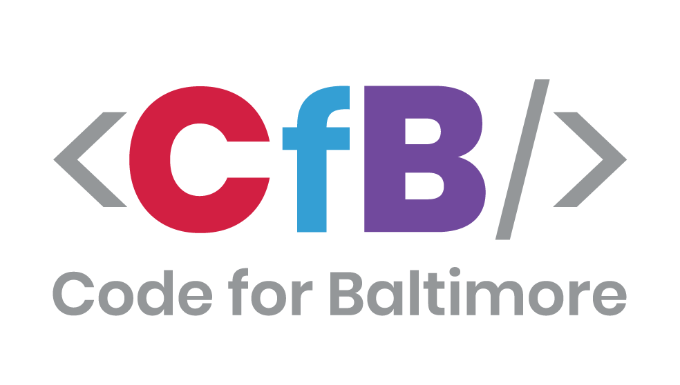

[](https://travis-ci.org/CodeForBaltimore/Bmore-Responsive) [](https://codecov.io/gh/CodeForBaltimore/Bmore-Responsive)

# Bmore Responsive
An API to drive disaster and emergency response systems.

## Documentation
We've included a `docs` folder with a template [Tech Spec](/docs/Tech_Spec.md) and [Best Practices](/docs/Best_Practices.md) document, though using Github's Wiki capabilities is also a good idea. This will get you started with documenting your project.  Other documents and relevant information that has no other place can live in the `docs` folder.  Replace this paragraph with a brief breakdown of what you've included in your `docs` folder.

### API Spec
Our API spec is on Swagger. You can view it here https://app.swaggerhub.com/apis/codeforbaltimore/bmoreResponsive/1.0.0#/ or you can find the `swagger.json` file in our `docs` folder.  

### Database Documentation
Our database documentation can be found in our `docs` folder under `database.csv`. This documentation was created using SchemaSpy. Instructions for use can be found here https://github.com/bcgov/schemaspy

## Setup
A `Dockerfile` and `docker-compose` file have been included for convenience, however this may not be the best local setup for this project. For more information on how to use Docker with this project, please see the [docker section](#docker).

To work on this project you should have:
-   NodeJS
-   PostgreSQL (can be in Docker)
-   Docker (optional)
Once you have the prerequisite software installed you can proceed to setup this application.

### Node and Express setup
This application is designed to work as an API driven by Express. To setup your environment first you must install all required dependencies by running the following command from the root of your project directory:
```
npm install
```
Once all dependencies are installed you will need to setup some environment variables to interact with your database and application. 

### Environment variables
You will need to set some local environment variables to run this application. This is true even if you're using Docker.
```
touch .env
echo 'NODE_ENV=local
PORT=<your port>
DATABASE_HOST=<your database host>
DATABASE=<your database name>
DATABASE_USER=<your database user>
DATABASE_PASSWORD=<your database password>
DATABASE_SCHEMA=<your database schema>
JWT_KEY=<your secret JWT seed phrase or key>
' >> ./.env
```

The various variables are defined as follows:
- `NODE_ENV` = The label for your environment. 
- `PORT` = The local port you wish to run on. Defaults to `3000`.
- `DATABASE_HOST` = The hostname of your db. _Probably_ `localhost` but if you're using our `docker-compose.yml` set it to `db`.
- `DATABASE` = Your database name. Postgres default is `postgres`.
- `DATABASE_USER` = Your local database login username. Postgres default is `postgres`.
- `DATABASE_PASSWORD` = Your local database login password. Postgres default is `postgres`.
- `DATABASE_SCHEMA` = Your local database schema. Postgres default is `public`.
- `JWT_KEY` = A secret value to generate JWT's locally. 
- `BYPASS_LOGIN` = _optional_  Allows you to hit the endpoints locally without having to login. If you wish to bypass the login process during local dev, set this to `true`.

_We do not recommend using the default options for PostgreSQL. The above values are provided as examples. It is more secure to create your own credentials._

### PostgreSQL
***You will need a PostgreSQL database running locally to run this application locally.*** You may setup PostgreSQL however you wish, however we recommend using Docker using the instructions found here: https://hub.docker.com/_/postgres

If you are using the Docker method you may spin up your database layer by running this command:
```
docker run -d -p 5432:5432 postgres
```
If you're running a database in another way then we trust you can sort it out on your own because you're awesome :sunglasses:

### Sequelize _<optional>_
You can run the application without doing anything and it will create the tables needed to operate automatically. It will not, however, create users. If you would like to seed your database with users you will need to follow a few steps.
1. You will need to create a `config.js` file in the `/sequelize` directory. Here is an example:
```
module.exports = {
  development: {
    username: <your postgres username>,
    password: <your postgres password>,
    database: <your postgres database name>,
    host: <your postgres host>,
    port: <your postgres port>,
    dialect: 'postgres'
  }
};
```
2. After you set your config options you may create your database tables without running the application by running `npm run db-create`.
3. To use the provided example seeder scripts you will need to create JSON data under the `/data` directory. You will have to match required fields of your table model. Here is an example of a `user-role.json` file:
```
[
    {
        "role": "Test",
        "description": "This is a test."
    }
]
```
4. You can now seed your database by running `npm run db-seed`. 

Example `/migrations` and `/seeders` scripts have been supplied. You can rollback your all seeded data at any time by running `npm run db-unseed` and delete all created tables with `npm run db-delete`.

To create new models, migrations, and seeders you _must_ use the Sequelize CLI commands. Full documentation is here https://sequelize.org/master/manual/migrations.html but here are a few useful commands:
- `npx sequelize-cli model:generate --name User --attributes firstName:string,lastName:string,email:string` - Creates a model under `/src/models` and a migration script.
- `npx sequelize-cli seed:generate --name demo-user` - Creates a seeder for the `User` model and migration previously setup.

### Docker
To use the `docker-compose.yml` file included you will first need to set [environment variables](#environment-variables). You **MUST** set your `DATABASE_HOST` to `db` to use the `docker-compose` solution. 

If you are running your own database, but want to use the `Dockerfile` you will need to run that this way on a Mac:
```
docker build -t bmoreres .
docker run -d -p 3000:3000 -e DATABASE_HOST=docker.for.mac.host.internal bmoreres
```
On Windows you would run:
```
docker build -t bmoreres .
docker run -d -p 3000:3000 -e DATABASE_HOST=docker.for.win.host.internal bmoreres
```

## Using this product
You may use this product to create and manage users for your front-end. More to come! 
To run the application--after the above steps are completed--run `npm start`.

## Testing
To test your code you may write test cases to `./index.spec.js` and then run the tests with `npm test`.

To check your linting you may run `npm run lint` and to format and automatically fix your formatting run `npm run format`.

## Sources and Links
We are also building a front-end application called [Healthcare Rollcall](https://github.com/CodeForBaltimore/Healthcare-Rollcall) to interact with this backend API. To view that project, or to contribute to it, please visit the repo here: https://github.com/CodeForBaltimore/Healthcare-Rollcall

We will be including multi-repo build processes with the front-end that will reference this project.

<p align="center">
    
</p>

