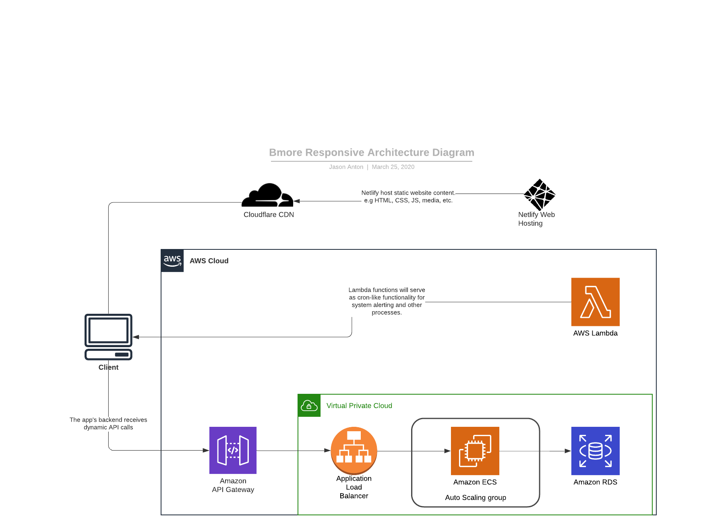
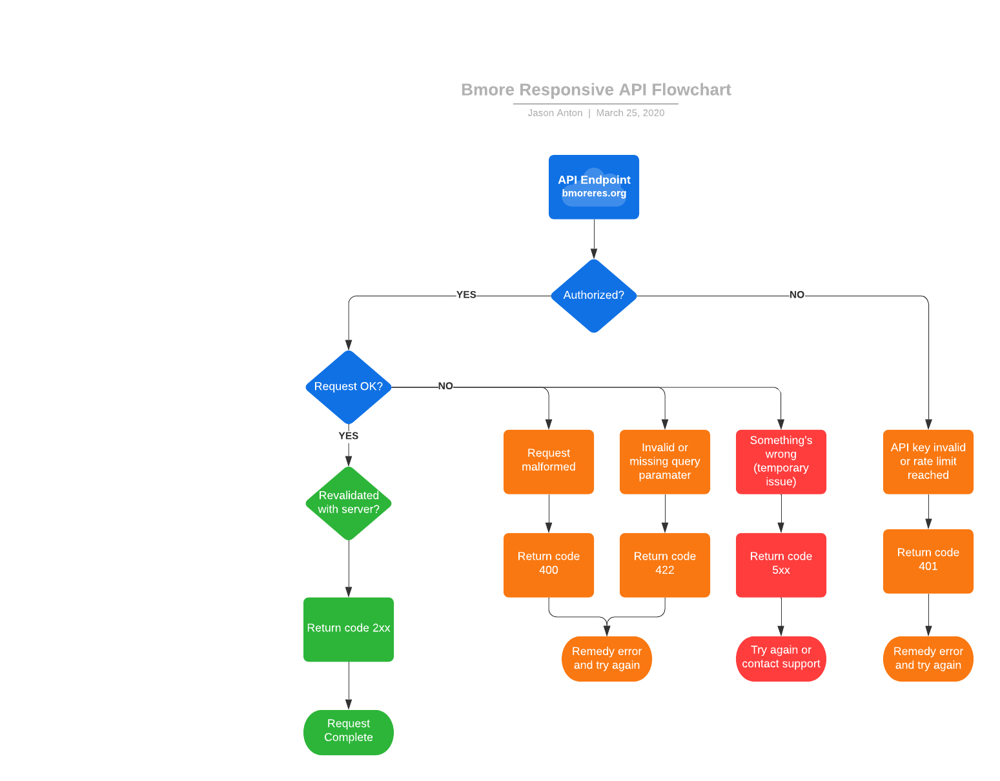
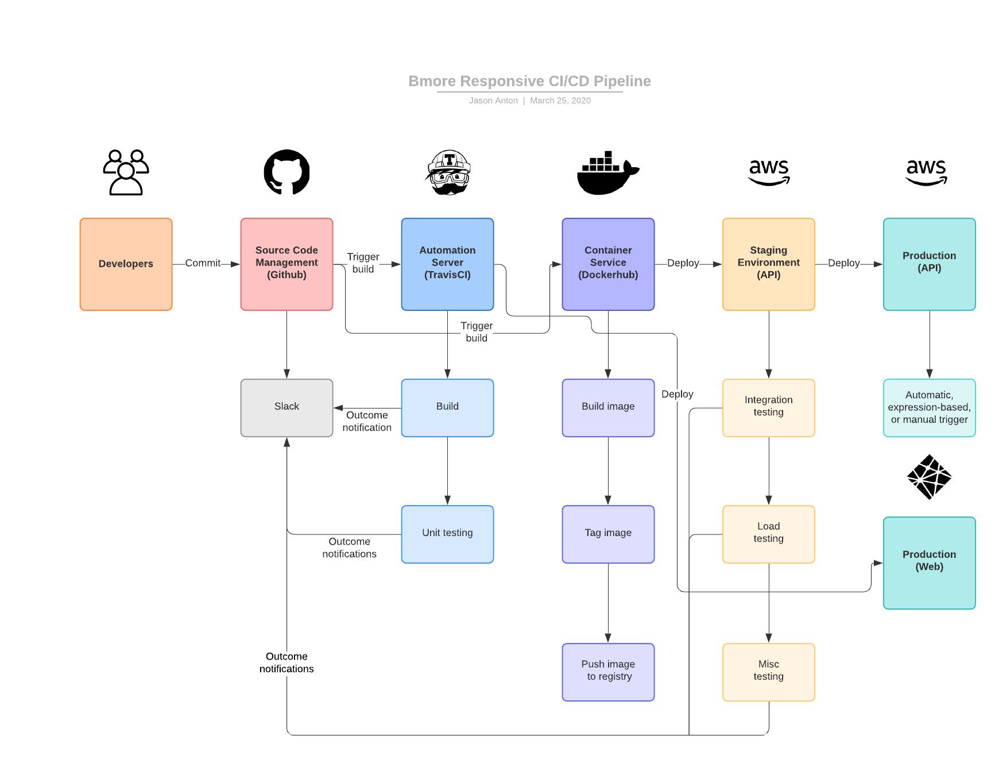
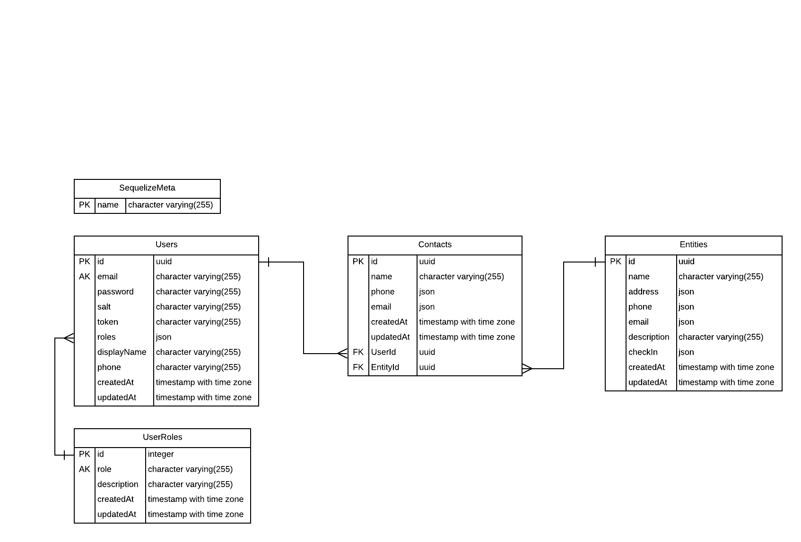

Wanna improve Bmore Responsive? This page will provide an introduction the to the architecture, implementation and processes of Bmore Responsive.

## Components

This application will be broken down into several components. Each will be outlined here.

### Application Architecture

The overall application will have several components in support of the code. These will facilitate secure communication between any front end, our API, and the data layer. Additionally our architecture will be designed to be scalable for instances of heavy load.

### API

The API is the application for all intents and purposes. Use of the API and possible paths of use are defined in the flowchart below.

### CI/CD

We will use Github Actions, Docker, Netlify, and AWS to provide constant code deployments and test coverage.

### Data

This product makes use of [PostgreSQL](https://www.postgresql.org/) for the data layer and [Sequelize](https://sequelize.org/) for database interactions. Our database documentation can be found in the `/sequelize` directory. The schema is outlined below

#### Migrations

Migrations are the scripts to create tables and initialize the database. Migrations can be written to run after the initial migration takes place.

It is important to note that the migrations run in sequential order, so using a numbering system is important. It is also important to note that FK columns and relationships can be **_and should be_** defined as their own migrations. This is to prevent errors of columns being created when the parent table no longer exists.

Individual migrations _can_ be reverted as per the Sequelize documentation.

#### Data Seeders

A seeder is a script to seed a particular set of data. As with Migrations these scripts run in order, so numbering is important.

Because of FK constraints it is again important to note when data is seeded to prevent errors with FK constraints. Imports can be chained in a single seed script, and this may be useful and advised for seeded data that is related through a FK.

To create new models, migrations, and seeders you _must_ use the Sequelize CLI commands. Full documentation is here https://sequelize.org/master/manual/migrations.html but here are a few useful commands:

- `npx sequelize-cli model:generate --name User --attributes firstName:string,lastName:string,email:string` - Creates a model under `/src/models` and a migration script.
- `npx sequelize-cli seed:generate --name demo-user` - Creates a seeder for the `User` model and migration previously setup.

#### NPM commands

This repo has simplified a few of the Sequelize CLI options that would be commonly used by this project.

- `npm run db-create` will create the database and run all migrations.
- `npm run db-delete` will delete all tables and revert all migrations.
- `npm run db-seed` will run all seeders and populate all data.
- `npm run db-unseed` will delete all data in all tables and revert all seeders.

### Role and Access Mgmt

User role management is being handled by [Casbin](https://casbin.org/). To facilitate this our migrations and seeding will replicate the `casbin_rule` table that would be generated by the casbin-sequelize package. We are then seeding as normal, however the field names are not straight-forward. They are defined as follows:

- `role` = The plain-text name of the role. _Example:_ `admin`
- `path` = The path the role has access to. _Example:_ `/user`
- `method` = The http method that can be hit. _Example_ `GET`

For use and management of roles after seeding, please refer to the API spec or Casbin Node.js documentation.
